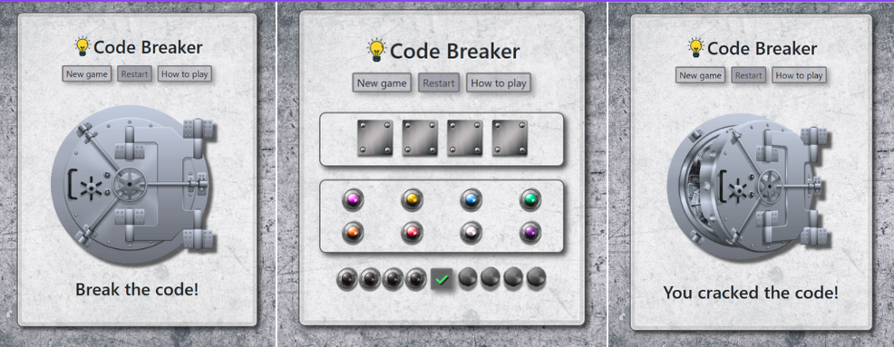
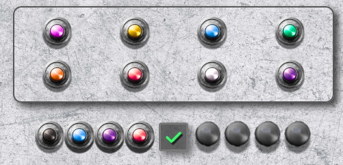
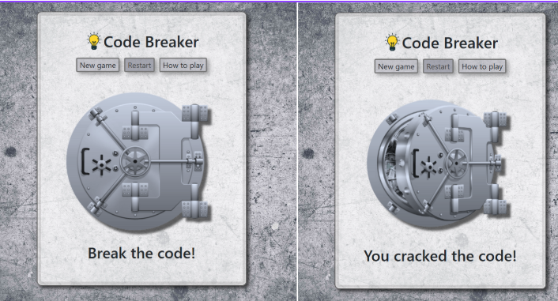
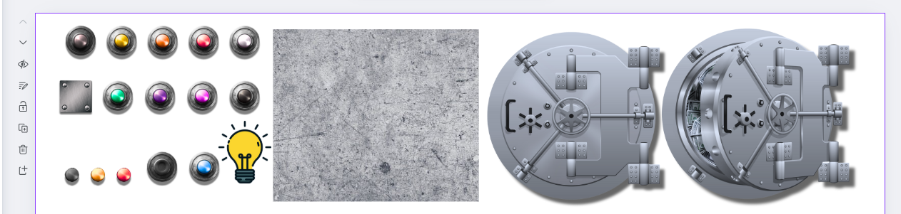
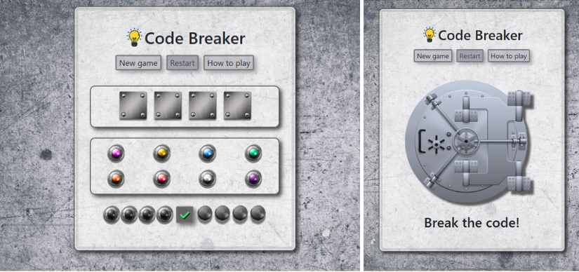
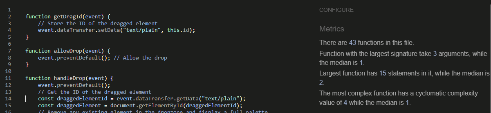
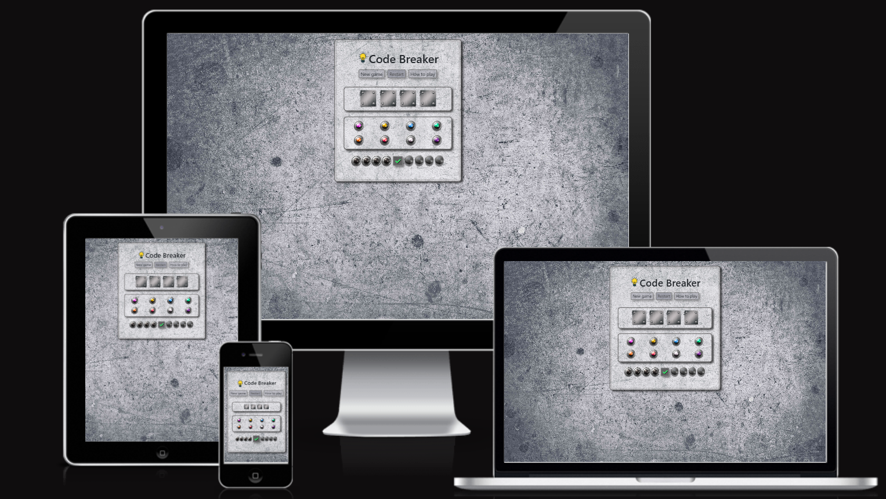
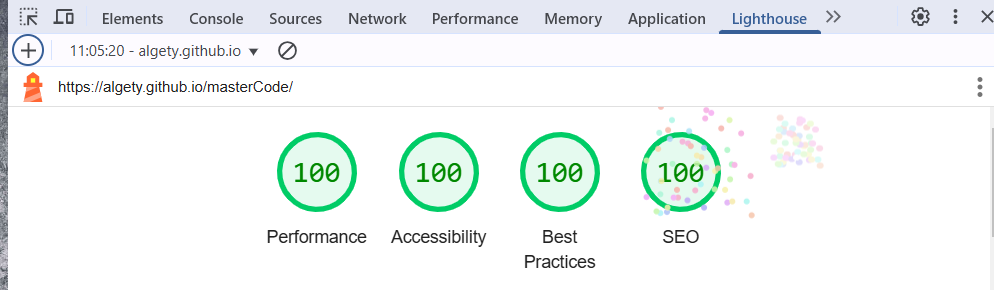
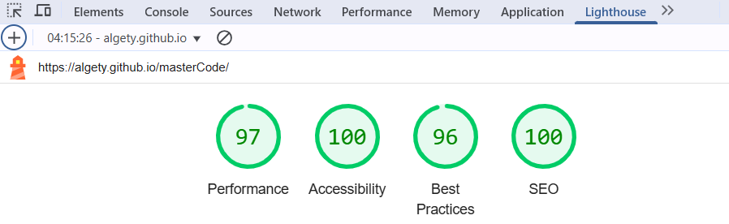

# Code Breaker (Mastermind)

The Code Breaker game, also known as Mastermind or Master Mind, is a challenging logic and deductive game for two players. One player (the codemaker) sets a secret code of colored pegs, and the other player (the codebreaker) tries to guess it, receiving feedback on their guesses.

The game was invented in 1970 by Mordecai Meirowitz, an Israeli postmaster and telecommunications expert. It is based on a paper and pencil game called Bulls and Cows. The first computer adaptation was run in the 1960s on Cambridge University’s Titan computer system, where it was called MOO.

In this adaptation of the game, a secret code is randomly generated by the computer using 8 possible colours. The player selects a difficulty level - easy (a 4-pin code) or medium (a 5-pin code). Colours in the code may repeat.
To make a guess, the player selects the colours of the pegs by clicking on the pins in the answer box, cycling through the available options. Once the guess is complete, clicking the check button submits the answer.
Feedback is then shown in the clue box: red pins represent pegs that are the correct colour and in the correct position, while yellow pins indicate correct colours placed in the wrong position. The order of the clue pins does not correspond to specific pegs in the answer.

This website has been created as the second Milestone project for Code Institute's Web Application Development Course. 

### View the live website [here](https://algety.github.io/masterCode/)
***
## Table of content: 
* [Site Goals](#site-goals)
* [User Experience UX](#user-experience---ux)
    * [User stories](#user-stories)
* [Design](#design)
    * [Structure](#website-structure)
    * [Style and design](#style-and-design)
    * [Colour](#colour)
* [Features](#features)
* [Wireframes](#wireframes)
* [Future Features](#future-features)
* [Technologies Used](#technologies-used)
    * [Languages Used](#languages-used)
    * [Frameworks - Libraries - Programs Used](#frameworks---libraries---programs-used)
* [Testing](#testing)
    * [Functional testing](#functional-testing)
    * [User testing](#user-testing)
    * [HTML, CSS and JS Validation](#htm,-css-and-js-validation)
        * [HTML checks](#html-checks)
        * [CSS checks](#css-checks)
    * [Responsiveness](#responsiveness)
    * [Performance Accessibility and SEO](#performance-accessibility-and-seo)
        * [Desktop Results](#desktop-results)
        * [Mobile Results](#mobile-results)
* [Deployment](#deployment)
* [Forking the Project](#forking-the-project)
* [Credits](#credits)
    * [Content](#content)
    * [Code](#code)
  

## Site Goals
The goals for this site are:
* Provide an engaging and challenging game.
* To help players improve logical deduction and problem-solving skills, and enhance cognitive abilities and strategic thinking through the game.
* Ensure accessibility and usability for all users.
  
To achieve the goals, the site should meet the following criteria:
* Intuitive and user-friendly interface.
* Clear and concise instructions.
* Adjustable difficulty levels: The site should offer different difficulty settings to cater to players with varying levels of expertise.
* Responsive design: The site should be fully functional and visually appealing on various devices and screen sizes, ensuring accessibility for all players.
* Immediate feedback on guesses: The game should provide clear and immediate feedback on players' guesses to help them improve and stay engaged.

## User Experience - UX
### User stories
#### A player
* As a player, I want to easily understand the main purpose about the site.
* As a player, I want to be able to easily navigate throughout the site to find relevant content.
* As a player, I want this website to be responsive to my device.
* As a player, I want to read the rules of the game to understand how to play and what the objectives are.
* As a player, I would like to set the difficulty level of the game so that I can choose a challenge that suits my skill level.
* As a player, I would like to see feedback on my guesses so that I can improve my strategy and get closer to cracking the code.
* As a player, I want to restart the game quickly so that I can try different strategies without delay.

#### A player (Edge Cases)
* As a player, I want to receive clear feedback when I submit an incomplete guess.
* As a player, I want confirmation before restarting a game in progress (will be implemented with the Restart button).

## Design
### Structure
The site consists of a single page where modals are used for displaying rules, setting game difficulty, and providing user feedback messages. The visibility of the main game and the modals is managed by applying and removing a CSS 'hide' class via JavaScript functions linked to button event listeners.

The structure includes a main container with a control container and a game container. The control container features a header with the game's title and three buttons below it that open modal boxes. The modals' and game container`s content is dynamically updated using innerHTML based on the activated event listener. At this stage of development, the "Restart" button is disabled, with its functionality planned for future implementation.

Before the game begins, the game container displays an image of a vault and a message encouraging the player to start the game. Once the game starts, the game container shows a code box, a palette box, and a reasoning box. The code box contains the code, hidden under metal plates until the player guesses it correctly. When the code is cracked, the plates disappear to reveal the code.
The palette box presents 8 coloured pins. The reasoning box comprises an answer box and a clue box. Players clicks on pins in the answer box to form their guess for the code, with each click the colour changes to the next from colour palette. After submitting their guess, feedback is displayed in the clue box. If the guess is incorrect, a new answer box is added below for another attempt.

### Style and design
Considering the character of the game, the goal is to ensure players can focus intently on the gameplay while making the colored pins prominently visible. The overall style of the game interface is industrial and modern, with a rugged and functional design. The concrete-textured background gives it a sturdy and serious feel, appropriate for a logic and deductive game.

### Colour
Shades of grey and metallic tones dominate the layout, creating a cohesive and focused appearance. These colours were picked to create a contrast of bright coloured pins against the muted background and also for the aim of following the industrial style. The yellow lightbulb icon next to the title adds a touch of brightness and symbolism for ideas or solutions.

## Features
### Main container
The main container resembles a device or machine with elements like metal plates, screws, and a vault door, evoking a sense of machinery and a secure facility. The container includes the control container and the game container. The control container’s appearance remains constant throughout the game. The game container, however, displays a message and an image of a locked vault before the game starts, the game board during the game, and an image of an unlocked vault if the player wins.

### Answer box interaction
The palette contains pegs in 8 different colours. In each answer box, clicking a peg cycles through the available colours. Once an answer is submitted, its pegs become disabled. After each incorrect guess, a new answer box appears for another attempt.

### Modals
There are 3 modals used in the site: a modal for setting the difficulty of the game, activated by the "New game" button; a modal with instructions, activated by the "How to play" button; and a modal with a message to the player if they try to submit an incomplete answer code.

## Wireframes
Wireframes were created in Canva.

## Future Features
1. Implement functionality for the Restart button.
2. Limit the number of tries.
3. Add a scrollbar to the reasoning box.
4. Show a confirmation before restarting an active game when clicking New Game.

## Technologies Used
### Languages Used 
* [HTML5](https://www.w3schools.com/html/default.asp).
* [CSS3](https://www.w3schools.com/css/default.asp).
* [JS](https://www.w3schools.com/css/default.asp).
### Frameworks - Libraries - Programs Used
* [Bootstrap:](https://getbootstrap.com/)
   * Bootstrap was used to acheave responsiveness of the website. 
* [Google Fonts:](https://fonts.google.com/)
   * Some icons on the site were sourced from the Google Fonts collection.
* [Font Awesome:](https://fontawesome.com/)
    * Some icons on the site were sourced from Font Awesome. 
* [GitHub:](https://github.com/)
    * GitHub is used to store the project's code after being pushed from Git.
* [Image Resizer:](https://imageresizer.com/)
    * Image Resizer was used to modify and resize the images on the website.
* [Canva](https://canva.com)
    * Canva was used to create the design of the page layouts.
* [Favicon Io](https://favicon.io/favicon-converter/)
    * Logo Design was used to creat the favicon images.
 
## Testing

### Functional testing
* Game Initialization
  - Game loads correctly with default settings
  - All buttons are enabled/disabled as appropriate
  - Modal windows render correctly

* Input Validation
  - Cannot submit incomplete guesses
  - Cannot select invalid colors
  - Cannot interact with disabled elements

* Game Logic
  - Code generation works correctly for both difficulties
  - Color matching algorithm handles repeated colors
  - Feedback pins accurately reflect guess correctness

### Manual Testing

#### New Game Button
- **Button Functionality**
  * Steps: Click "New Game" button
  * Expected: Modal appears with difficulty options
  * Result: Modal appears as expected

- **Visual Feedback**
  * Steps: Hover over and click button
  * Expected: Button shows hover state and click animation
  * Result: Feedback visible

#### Difficulty Selection
- **Easy Mode**
  * Steps: 
    1. Click "New Game"
    2. Select "Easy"
    3. Click "Start"
  * Expected: Game starts with 4 pins
  * Result: 4 pins displayed correctly

- **Medium Mode**
  * Steps:
    1. Click "New Game"
    2. Select "Medium"
    3. Click "Start"
  * Expected: Game starts with 5 pins
  * Result: 5 pins displayed correctly

#### Color Selection
- **Pin Cycling**
  * Steps:
    1. Start new game
    2. Click answer pin multiple times
  * Expected: Colors cycle through all 8 options
  * Result: Colors cycle correctly

- **Multiple Pins**
  * Steps: Click different answer pins
  * Expected: Each pin changes independently
  * Result: Independent changes confirmed

#### Submit Guess
- **Complete Guess**
  * Steps:
    1. Set all pins to colors
    2. Click submit
  * Expected: Feedback appears in clue box
  * Result: Feedback displayed correctly

- **Incomplete Guess**
  * Steps:
    1. Set only some pins
    2. Click submit
  * Expected: Error message appears
  * Result: Error shown correctly

#### Feedback System
- **Correct Position**
  * Steps: Submit guess with correct positions
  * Expected: Red pins match correct positions
  * Result: Accurate feedback shown

- **Correct Color**
  * Steps: Submit guess with correct colors
  * Expected: Yellow pins match correct colors
  * Result: Accurate feedback shown

#### Game Win
- **Complete Code**
  * Steps:
    1. Enter correct code
    2. Submit guess
  * Expected: Victory screen appears
  * Result: Success screen shown correctly

#### Instructions
- **Access Rules**
  * Steps:
    1. Click "How to play"
    2. Read instructions
    3. Close modal
  * Expected: Rules are clear and modal closes
  * Result: Functions as expected

#### Responsive Design
- **Mobile View**
  * Steps: Test on various screen sizes
  * Expected: Layout adjusts appropriately
  * Result: Responsive design works correctly

- **Touch Interaction**
  * Steps: Test on touch devices
  * Expected: Touch controls work smoothly
  * Result: Touch functions work correctly

#### Bug Fixes
- **Drag-and-Drop Issue**
  * Bug: Inconsistent behavior on mobile devices
  * Fix: Replaced with click/tap color cycling

- **Color Distinction**
  * Bug: Similar shades of pink/purple and red/orange
  * Status: To be addressed in future update

- **Modal Close**
  * Bug: Users struggled to find how to close
  * Fix: Added dedicated close button

### User Testing
Twelve players tested the game. 

Initially, selecting the colour of an answer peg was implemented using drag-and-drop functionality. However, testing revealed that the palette and answer box elements performed inconsistently on mobile devices. As a result, the colour selection method was changed to a click-based system, allowing users to cycle through colours by tapping directly on each peg.

Furthermore, players found it confusing that the clue pin indicating the correct color and position is red, rather than the expected green. This will also be addressed in a future update. Also, the colours of the pink and purple pins, as well as the red and orange pins, need to be more distinct from each other.

Despite the rules stating that clue pins only show quantities, new players still assumed that each clue pin corresponded to a specific position in their guess (e.g., first clue pin showing feedback for the first answer pin). The rules were rewritten to better emphasize this crucial point: clue pins indicate only the total number of correct colors and positions, with no correlation between clue pin placement and answer pin positions.

Users were uncertain how to close the instruction modal, as clicking outside the modal wasn't an intuitive action for many. A dedicated close button was added to improve user experience and make the interface more intuitive.

### HTML, CSS and JS Validation
The W3C Markup Validator and W3C CSS Validator services were used to validate the project's pages for syntax errors.
The screenshots below provide the results of testing.

#### HTML checks
)

#### CSS checks
)

#### JavaScript checks
No errors were returned when passing through JSHint. The following metrics were returned:
There are 43 functions in this file. Function with the largest signature take 3 arguments, while the median is 1.
Largest function has 15 statements in it, while the median is 2. The most complex function has a cyclomatic complexity value of 4 while the median is 1.

### Responsiveness
The project was tested using the Chrome Developer Tools and Amiresponsive site to verify responsiveness of the site.
* Devices tested using the Google Developer Tools emulator:
    * iPhone XR
    * iPhone 12 Pro
    * iPhone 14 Pro Max
    * Pixel 7
    * Samsung Galaxy S8+
    * Samsung Galaxy S20 Ultra
    * iPad Mini
    * iPad Air
    * iPad Pro
    * Surface Pro 7
    * Surface Duo
    * Galaxy Z Fold 5
    * Asus Zenbook Fold
    * Samsung Galaxy A51/71
    * Nest Hub
    * Nest Hub Max
      

 
All the pages of the site are displayed correctly on different devices.

### Performance Accessibility and SEO
Google Lighthouse was used to test Performance, Best Practices, Accessibility and SEO.
#### Desktop Results

#### Mobile Results

## Deployment
Development on [GitPod](https://gitpod.io/) with the Code Institute template, stored at [GitHub](https://github.com/).
The website development was created in the "main" branch. This branch was deployed using GitHub Pages.
This site was deployed by completing the following steps:

1. Open [GitHub](https://github.com/) and log in.
2. Locate the needed GitHub repository.
3. Navigate to the "Settings".
4. On the left-hand sidebar, in the Code and automation section, navigate down to the "Pages".
5. Click on the Page link.
6. On the page pick source to set to 'Deploy from Branch', select Main branch and set Folder to / (root).
7. After saving, the page will refresh automatically. A link to the deployed website will be displayed.

## Forking the Project
1. Open [GitHub](https://github.com/) and log in.
2. Locate the needed GitHub repository and click on it.
3. Click the 'Fork' button to the top right of the page.
4. After clicking the button, the fork will appear in your repository.
   
## Credits
### Content
1. The check icon for the submit button - [Font Awesome](https://fontawesome.com/), [Google Fonts](https://fonts.google.com/)
2. The game logo and favicon icon - [Flaticon](https://www.flaticon.com/)
3. Images edited, templates and layouts made in Canvas - [Canvas](https://www.canva.com/)
4. Favicon sized with [Favicon Io](https://favicon.io/favicon-converter/)
5. Free images - [Freepik](https://www.freepik.com/), [PNGTree](https://pngtree.com/)
6. Images resized with - [Image Resizer](https://imageresizer.com/)
### Code
1. Code samples have been adapted specifically for the site - [W3 Schools](https://www.w3schools.com/), [Bootstrap Documentation](https://getbootstrap.com/docs/5.3/).
2. Special thanks to my mentor Spencer Baribal and tutor Roman Rakic for their valuable advice and guidance in resolving development challenges.

